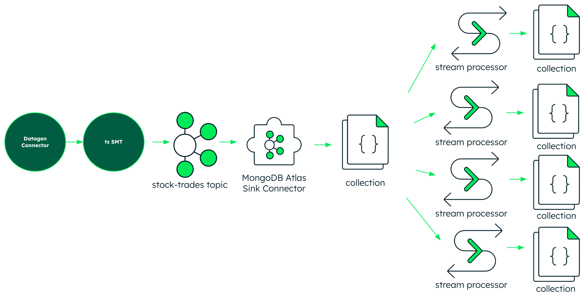
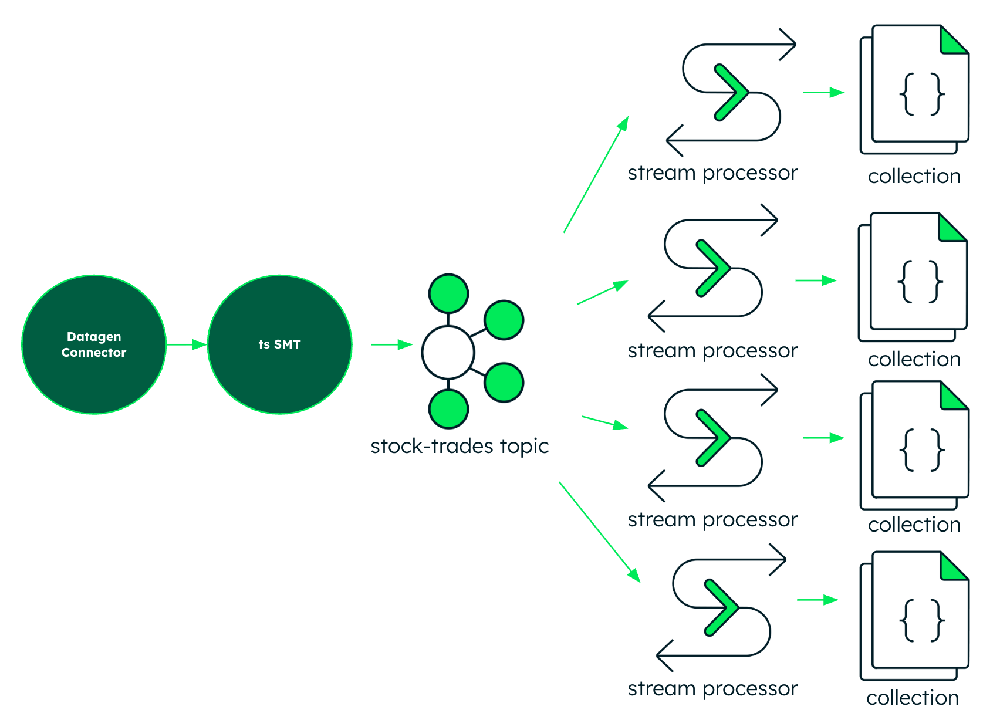

# MongoDB Atlas Stream Processing: No Sinks, No Flink

This project uses terraform to reproduce and illustrate my initial work with Confluent Cloud and MongoDB Atlas Stream Processing.

##  Project Structure

Each phase uses the Datagen source connector to populate a Kafka topic with stock trade data. An SMT sets the timestamp field. In MongoDB Atlas Stream Processing, four parallel stream processors run on the stream:
* unique ticker count per time window
* trades per unique ticker per time window
* min max trades per ticker per time window
* CEP: "bounce pattern" per ticker per time window, ported from the FlinkSQL example at flink.apache.org

---
### No Flink: Processing a collection populated by a sink connector

* **`01-terraform-atlas-sink/`**: The "Connector" pattern. Uses the Confluent Cloud Managed Atlas Sink Connector to move raw data from Kafka into a MongoDB collection. The four processors populate dirived collections with aggregate data akin to a streaming materialized view.

---
### No Flink, No Sinks: Processing a stream directly from the source topic

* **`02-terraform-asp/`**: The "Direct" pattern. Leverages **Atlas Stream Processing (ASP)** to connect directly to Kafka as a consumer, performing Complex Event Processing (CEP) and windowed aggregations in-flight.

---

##  Deployment Guide

### Prerequisites
* Terraform CLI
* Confluent Cloud Cluster & API Keys
* MongoDB Atlas Project & API Keys

### Setup Instructions
1. **Initialize Environment**: Ensure your `terraform.tfvars` contains your specific organization and project IDs.
2. **Deploy Phase 1**: Navigate to `/01` to establish the baseline ingestion.
3. **Deploy Phase 2**: Navigate to `/02`. Note that this will establish a direct connection from the Atlas Stream Instance to the Confluent Brokers.

In either directory, `terraform apply` will set up the demo.

---
