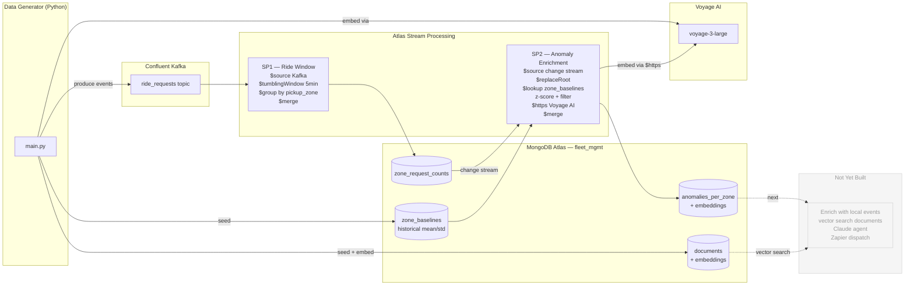

```mermaid
flowchart LR
    subgraph datagen["Data Generator (Python)"]
        DG[main.py]
    end

    subgraph kafka["Confluent Kafka"]
        RT[ride_requests topic]
    end

    subgraph atlas["MongoDB Atlas — fleet_mgmt"]
        ZB[(zone_baselines\nhistorical mean/std)]
        DOCS[(documents\n+ embeddings)]
        ZRC[(zone_request_counts)]
        APZ[(anomalies_per_zone\n+ embeddings)]
    end

    subgraph voyage["Voyage AI"]
        VAI[voyage-3-large]
    end

    subgraph asp["Atlas Stream Processing"]
        SP1["SP1 — Ride Window\n$source Kafka\n$tumblingWindow 5min\n$group by pickup_zone\n$merge"]
        SP2["SP2 — Anomaly Enrichment\n$source change stream\n$replaceRoot\n$lookup zone_baselines\nz-score + filter\n$https Voyage AI\n$merge"]
    end

    subgraph todo["Not Yet Built"]
        NEXT["Enrich with local events\nvector search documents\nClaude agent\nZapier dispatch"]
    end

    DG -->|produce events| RT
    DG -->|seed| ZB
    DG -->|seed + embed| DOCS
    DG -->|embed via| VAI

    RT --> SP1
    SP1 --> ZRC
    ZRC -->|change stream| SP2
    ZB --> SP2
    SP2 -->|embed via $https| VAI
    SP2 --> APZ

    APZ -.->|next| NEXT
    DOCS -.->|vector search| NEXT

    style todo fill:#f5f5f5,stroke:#ccc,color:#999
    style NEXT fill:#f5f5f5,stroke:#ccc,color:#999
```
